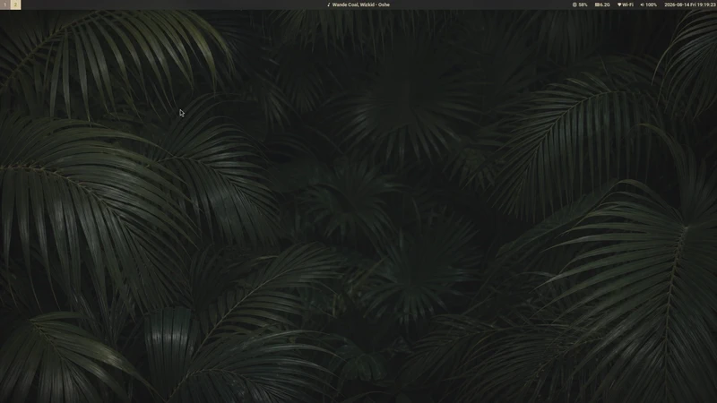

# Arch Wayland dotfiles

Arch Linux、Hyprland、UWSMを使うworkstation設定です。



- Ansible: 公式package、system service、udev rule
- chezmoi: ユーザー設定、systemd user unit
- UWSM: Wayland session

主対象はPanasonic Let's Note CF-SZ6です。別の機種では、適用前に
[`ansible/inventory/localhost.yml`](ansible/inventory/localhost.yml)の
`letsnote_enabled`と`hardware_packages`を確認してください。

## セットアップ

`sudo`を使える一般ユーザーで実行します。

```bash
sudo pacman -Syu --needed git
git clone https://github.com/0xNOY/dotfiles.git \
  "$HOME/.local/share/chezmoi"
cd "$HOME/.local/share/chezmoi"
./bootstrap
```

適用前に確認する場合は、個別にcheck modeとdiffを実行します。

```bash
cd "$HOME/.local/share/chezmoi/ansible"
ansible-playbook --check --diff site.yml
cd ..
chezmoi diff
```

更新時は`git pull --ff-only`の後にAnsibleとchezmoiを再適用します。

```bash
cd "$HOME/.local/share/chezmoi"
git pull --ff-only
(cd ansible && ansible-playbook site.yml)
chezmoi apply
```

## 任意の操作

次の操作は既定では実行しません。

```bash
cd "$HOME/.local/share/chezmoi/ansible"
sudo -v
ansible-playbook site.yml --tags aur
ansible-playbook site.yml --tags privileged
ansible-playbook site.yml --tags cleanup
```

- `aur`: 確認済みの`yay`でAUR packageを導入
- `privileged`: ユーザーを`docker`と`adbusers`へ追加
- `cleanup`: 旧X11 packageとserviceを削除

影響と管理対象外の秘密情報は[SECURITY.md](SECURITY.md)を参照してください。

## セッション

TTYから起動します。`x`は同じ処理への短縮コマンドです。

```bash
uwsm start hyprland.desktop
x
```

主な操作は`Super + Return`でGhostty、`Super + Space`でRofi、
`Super + Shift + S`または`Print`でスクリーンショット、`Super + X`で画面lockです。

壁紙は既存の`~/Pictures/wallpapers/wallpaper2_1920x1200.png`を優先し、なければ
同梱画像を使います。出典は[docs/WALLPAPER.md](docs/WALLPAPER.md)に記録しています。

## Wheel Pad

CF-SZ6用daemonは物理touchpadを排他grabするため自動起動しません。別の入力手段を
確保してから有効にします。

```bash
touch ~/.config/letsnote-wheelpad/enabled
systemctl --user start letsnote-wheelpad.service
```

問題があれば停止し、markerを削除します。

```bash
systemctl --user stop letsnote-wheelpad.service
rm ~/.config/letsnote-wheelpad/enabled
```

## 確認

```bash
hyprctl configerrors
systemctl --user --failed
systemctl --failed
```
